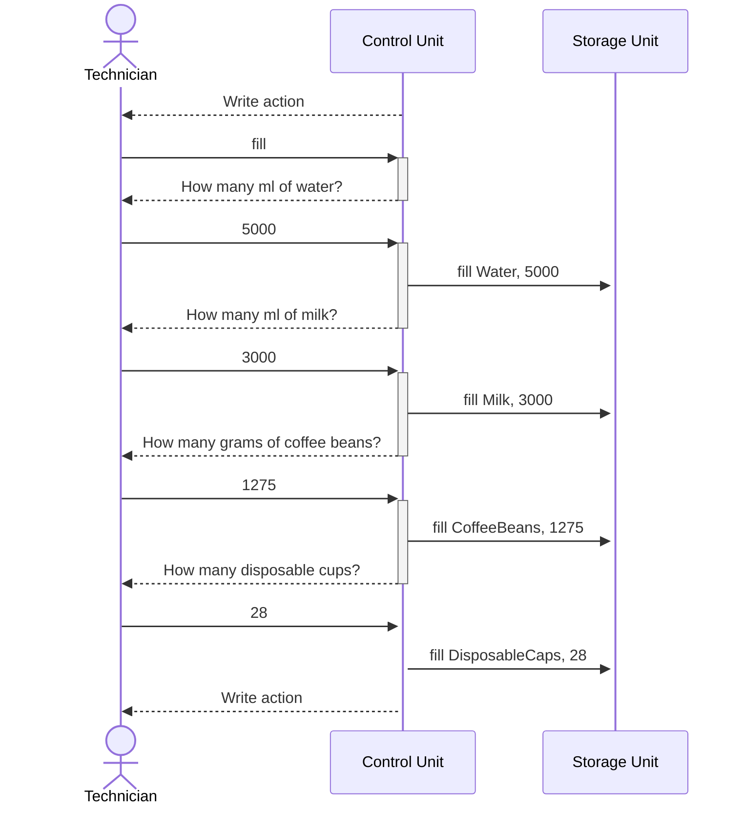

# Coffee Machine

Implementation of the [educational project](https://hyperskill.org/projects/67?track=18).

## Reports
- [Specifications](https://rabestro.github.io/coffee-machine/)
- [Gradle Test Report](https://rabestro.github.io/coffee-machine/test)
- [Code coverage](https://rabestro.github.io/coffee-machine/jacocoHtml)

## Coffee Machine control state diagram

## Resources replenishment Sequence diagram

