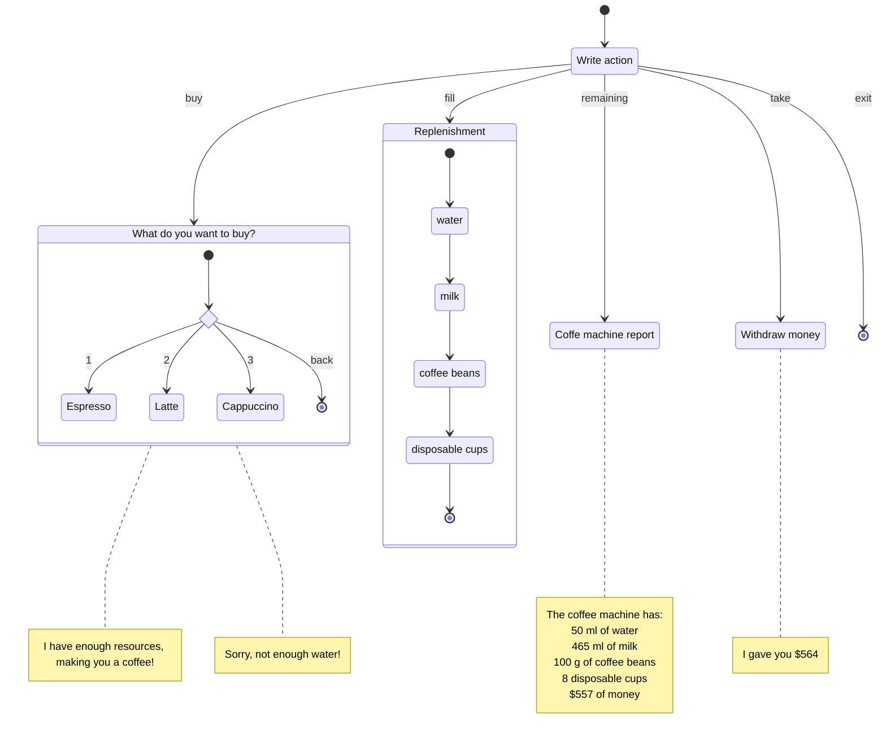

# Coffee Machine

The repository contains sample tests written using the Spock Framework. Tests written to solve an educational project from jetbrains Academy.

The [main objective](https://hyperskill.org/projects/67/stages/365/implement) of [the project](https://hyperskill.org/projects/67?track=18) was to use objects to simulate the operation of real devices. It was necessary to create a class with a method that takes a string as input. Below are quotes from the problem statement:

> Every time the user inputs a string to the console, the program invokes this method with one argument: the line that the user inputs to the console. This system simulates pretty accurately how real-world electronic devices work. External components (like buttons on the coffee machine or tapping on the screen) generate events that pass into the single interface of the program.
>
> The class should not use system input at all; it will only handle the input that comes to it via this method and its string argument.
>
> The right solution to this problem is to store the current state of the machine. The coffee machine has several states it can be in. For example, the state could be "choosing an action" or "choosing a type of coffee". Every time the user inputs something and a program passes that line to the method, the program determines how to interpret this line using the information about the current state. After processing this line, the state of the coffee machine can be changed or can stay the same.

In this project, this class is called [Control Unit](https://github.com/rabestro/coffee-machine/blob/main/src/main/kotlin/lv/id/jc/machine/unit/ControlUnit.kt). Requests from users are passed to the class by calling `process` method. The control unit itself controls [storage](https://github.com/rabestro/coffee-machine/blob/main/src/main/kotlin/lv/id/jc/machine/unit/StorageUnit.kt) and display. Schemes of interaction between devices are presented in [wiki](https://github.com/rabestro/coffee-machine/wiki) pages.

## Reports
- [Specifications](https://rabestro.github.io/coffee-machine/)
- [Gradle Test Report](https://rabestro.github.io/coffee-machine/test)
- [Code coverage](https://rabestro.github.io/coffee-machine/jacocoHtml)

## Coffee Machine control state diagram

