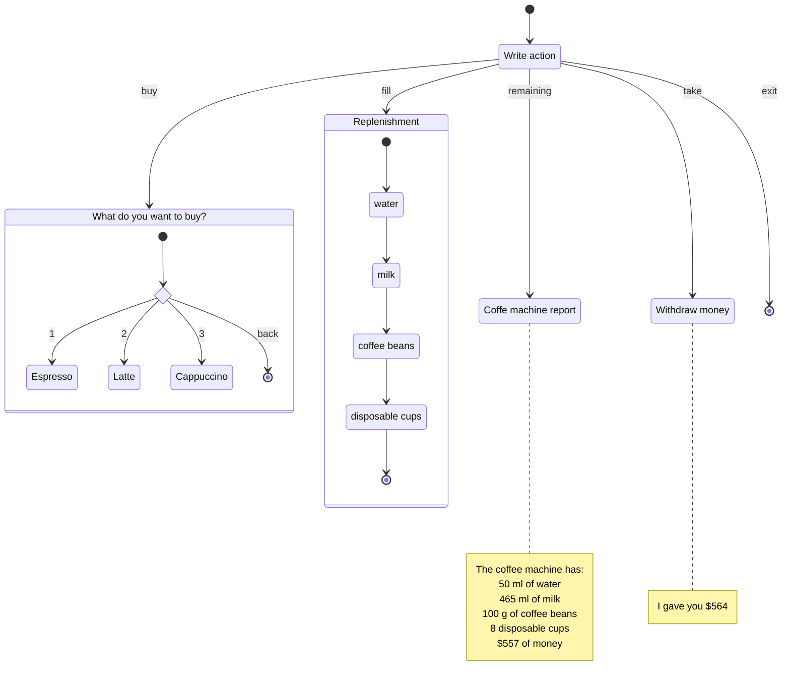

# Coffee Machine

Implementation of the educational project.

## State diagram

```mermaid
stateDiagram-v2
    Menu: Write action

    Buy: What do you want to buy?
    state Buy {
        state coffee <<choice>> 
            coffee --> Espresso: 1
            coffee --> Latte : 2
            coffee --> Cappuccino: 3
            coffee --> [*]: back
        [*] --> coffee
    }

    Fill: Replenishment
    state Fill {
        beans: coffee beans
        cups: disposable cups
        [*] --> water
        water --> milk
        milk --> beans
        beans --> cups
        cups --> [*]
    }

    Remaining: Coffe machine report
    note right of Remaining
        The coffee machine has:
        50 ml of water
        465 ml of milk
        100 g of coffee beans
        8 disposable cups
        $557 of money
    end note

    Take: Withdraw money
    note right of Take: I gave you $564

    [*] --> Menu
    Menu --> Buy : buy
    Menu --> Fill: fill
    Menu --> Remaining: remaining 
    Menu --> Take: take
    Menu --> [*] : exit
```